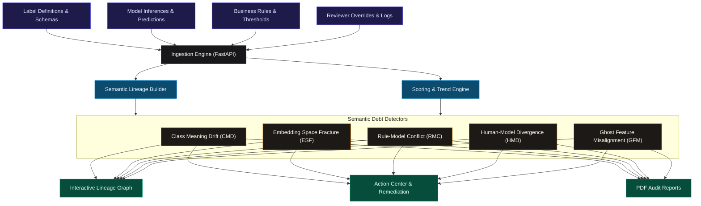

# 🗺️ Semantic Debt Mapper (SDM)

[](https://github.com/NitheshK4/Semantic-DebtMapper/actions/workflows/ci.yml)
[](https://fastapi.tiangolo.com)
[](https://react.dev)
[](https://www.docker.com)

**Pinpoint legacy AI meaning assumptions before they silent-fail downstream decisions.**

---

### What is Semantic Debt?
**Semantic debt** represents the hidden mismatch between the *active meaning* of schema elements (revised policies, prompt changes, updated label definitions) and the *legacy calibrations* under which downstream business logic, machine learning models, or human override thresholds were originally configured. 

SDM is a production-grade AI reliability and governance platform that ingests your pipelines, models, and override logs to map, flag, and remediate these meaning inconsistencies.

---

## 🏗️ System Architecture & Data Flow

SDM links data definitions, classification models, override rules, and human-in-the-loop decisions into a unified dependency model:



### Technical Stack
* **Backend:** Python FastAPI, SQLAlchemy ORM, SQLite (local development) / PostgreSQL (production with `pgvector`).
* **Detectors:** NumPy-based vector similarity calculation, statistical drift analysis, and boundary override detection.
* **Frontend:** React 19, TypeScript, Vite, Vanilla CSS custom styling, React Flow (interactive lineage graphs), Recharts (trends and data analysis).
* **Testing:** Pytest (ingestion, API endpoints, and detector heuristics).

---

## 🔍 Core Detectors

SDM continuously audits ML pipelines using 5 specialized, deterministic detectors:

| Detector | Target Risk | Mechanism | Trigger Threshold |
| :--- | :--- | :--- | :--- |
| **1. Class Meaning Drift (CMD)** | Shifted schema definitions with outdated legacy data references. | Calculates Cosine Similarity between vector embeddings of consecutive definition versions and measures reviewer override delta. | Similarity $< 0.92$ & override increase $> 10\%$ |
| **2. Embedding Space Fracture (ESF)** | Legacy indices read by updated model query vectors. | Compares deployed model geometry with index version metadata in the vector DB. | Embedding dimension mismatch / tag discrepancy |
| **3. Rule-Model Conflict (RMC)** | Stale rules/overrides calibrated on legacy models acting on new score distributions. | Scans active rules pointing to old model tags and measures override rate at decision boundaries. | Override rate in threshold band $> 20\%$ |
| **4. Human-Model Divergence (HMD)** | Systemic prediction failures in specific cohorts. | Cohort grouping comparison against global override rates; extracts failure patterns via NLP. | Override rate $> 20\%$ & delta from baseline $> 15\%$ |
| **5. Ghost Feature Misalignment (GFM)** | Rules referencing stale or deleted schema attributes. | Scans AST/regex patterns of active rule expressions against historical vs. active model features. | Active rule uses inactive/renamed feature |

---

## 🛠️ Configuration & Security

The API endpoints require an API Key passed via the `X-API-Key` HTTP header.

### Environment Setup
Create a `.env` file in the root directory (or use `.env.example` templates):

#### Backend (`backend/.env`)
```env
DATABASE_URL=sqlite:///./sdm.db
API_KEY=your-secure-backend-api-key
```

#### Frontend (`frontend/.env`)
```env
VITE_API_URL=http://localhost:8005/api/v1
VITE_API_KEY=your-secure-backend-api-key
```

---

## 🚀 Getting Started

### Option 1: Running with Docker Compose (Recommended)
Spin up PostgreSQL, Redis, FastAPI backend, Vite dev server, and worker containers:
```bash
docker compose up --build
```
* **Dashboard Interface:** `http://localhost:5173`
* **API Documentation (Swagger):** `http://localhost:8005/docs`

### Option 2: Running Locally (Development Mode)

#### 1. Start Backend API
```bash
cd backend
python3 -m venv venv
source venv/bin/activate
pip install -r requirements.txt

# Run migrations/setup
export API_KEY=dev-key-123
export DATABASE_URL=sqlite:///./sdm.db
python3 -m uvicorn app.main:app --port 8005 --reload
```

#### 2. Start Frontend App
```bash
cd frontend
npm install
npm run dev
```

---

## 🧪 Verification & Testing

### Running Python Tests
We maintain comprehensive unit and integration test coverage:
```bash
cd backend
export API_KEY=dev-key-123
export DATABASE_URL=sqlite:///./sdm.db
PYTHONPATH=. pytest tests/
```

### Running Frontend Quality Audits
Verify TypeScript compilation and ESLint compliance:
```bash
cd frontend
npm run lint
npm run build
```

---

## 📈 Interactive Walkthrough (Demo Dataset)
To immediately visualize semantic debt:
1. Start both servers.
2. Go to **Ingestion Center** in the sidebar.
3. Click **"Load Support Ticket Demo"**. This will ingest a simulated dataset with injected semantic drifts (CMD, ESF, RMC, HMD, GFM).
4. Navigate to the **Overview**, **Findings**, and **Lineage Graph** pages to inspect computed metrics and trace semantic failures
